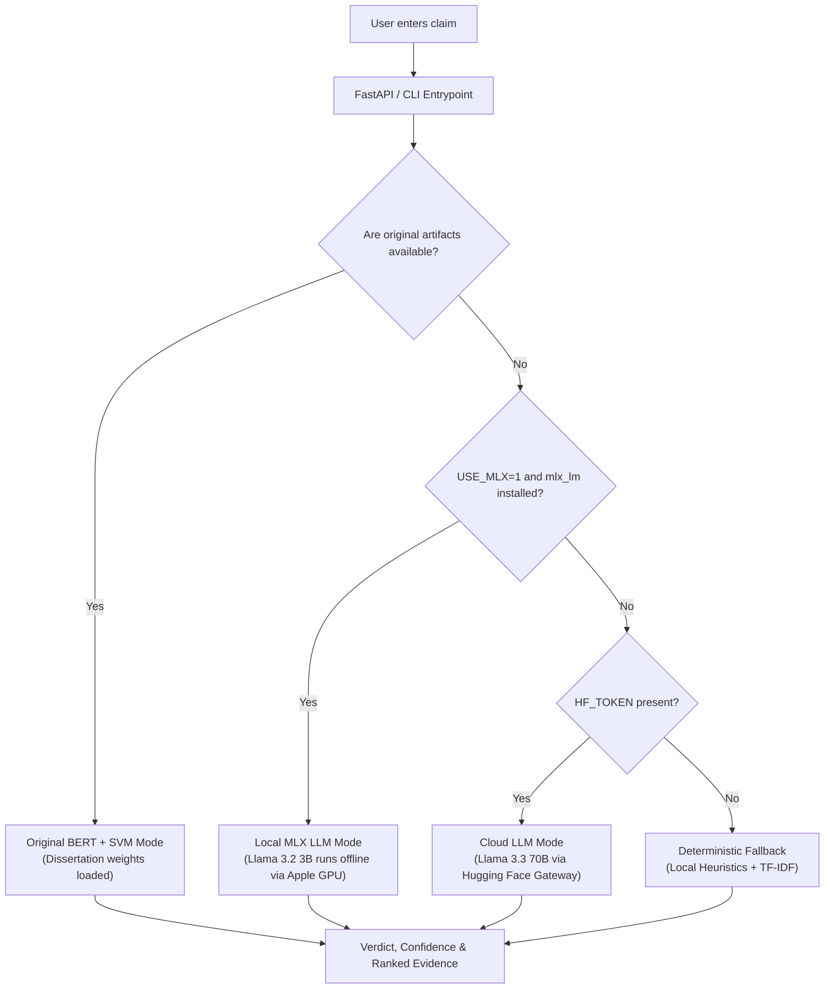

# Claim Evidence Checker

An MSc dissertation project at **Queen Mary University of London** — a reproducible FastAPI application for deterministic claim screening, evidence retrieval, and coarse stance analysis, built from an earlier BERT/SVM notebook experiment on conflict-news claim detection.

> This project is an academic dissertation demonstrating how to turn notebook-era ML research into a deployable, testable engineering artifact. It does **not** claim to be a production fact-checker, and it does **not** present synthetic evaluation results as real-world model accuracy.

## Live Demo

**🔗 [https://claim-detection-project.vercel.app](https://claim-detection-project.vercel.app)**

Deployed on Vercel as a serverless Python function.

---

## How It Works: Original vs. Demo Variant

This codebase features a hybrid architecture designed to support your original dissertation models locally while running a high-accuracy, lightweight LLM-augmented variant in the cloud:

| Feature | Original Dissertation Model | Vercel Demo Variant |
| :--- | :--- | :--- |
| **Classifier** | Fine-tuned BERT (`bert-base-uncased`) + Support Vector Classifier (`svc_model.joblib`) | **Llama 3.3 70B** LLM via Hugging Face Serverless gateway |
| **Inference Cost** | 0% (runs locally on your CPU/GPU) | **0% (100% Free)** via Hugging Face serverless provider API |
| **Package Weight** | **~500 MB** (Exceeds Vercel's 50MB serverless limit) | **< 1 MB** (Very lightweight and fast setup) |
| **Local Offline Run** | Supported via PyTorch/MPS on Apple Silicon | Supported via local **Llama 3.2 3B** offline using Apple's MLX |

### Fail-safe Fallback Architecture
The app dynamically selects the best execution path based on resource availability:
1. **Original Mode**: Automatically loads and runs the custom `bert_model.pth` and `svc_model.joblib` if they are present in the `artifacts/` folder.
2. **Local MLX LLM**: Falls back to local, offline hardware-accelerated `Llama-3.2-3B` if running on Apple Silicon with `USE_MLX=1` set.
3. **Cloud LLM (Vercel)**: Runs the free, high-accuracy `Llama-3.3-70B` in the cloud if `HF_TOKEN` is present.
4. **Deterministic Fallback**: Cascades to local rules and TF-IDF if no artifacts or API keys are configured, ensuring the app **never crashes**.

---

## Why this project matters

The project demonstrates how to turn a notebook-only ML experiment into a deployable, testable AI engineering artifact. The upgrade separates deterministic software behavior from model-quality claims, adds CI-safe evaluation, and includes overfitting checks that would be required before presenting the historical BERT/SVM model as reliable.

## What It Does

- Scores whether an input sentence looks like a factual claim.
- Ranks candidate evidence snippets using TF-IDF cosine similarity.
- Produces a conservative verdict: `supported`, `refuted`, `uncertain`, `insufficient_evidence`, or `not_a_clear_claim`.
- Serves the workflow through a FastAPI API and a lightweight web UI.
- Supports optional RSS ingestion to fact-check against live world news.
- Includes reproducible evaluation, latency benchmarks, Vercel deployment, and GitHub Actions CI.

## Important Model and Overfitting Note

The original notebook records the following historical BERT/SVM results:

- Validation accuracy: `0.8817 (+/- 0.0058)`
- Validation F1: `0.8810 (+/- 0.0059)`
- Test accuracy: `0.9061`
- Test F1: `0.9068`

Those numbers are preserved only as historical notebook output. They are **not reproduced by the clean repository** unless the model weights are provided. The repo now includes [`evaluation/leakage_audit.py`](evaluation/leakage_audit.py) to flag suspicious perfect scores, large train-validation gaps, small split sizes, and duplicated claim/evidence examples across splits when real prediction files are available.

## Architecture



## API

Start locally:

```bash
pip install -r requirements.txt
uvicorn claim_detection.api:app --reload
```

Health check:

```bash
curl http://127.0.0.1:8000/health
```

The health response includes the app mode and any missing historical model artifacts.

Analyze a claim:

```bash
curl -X POST http://127.0.0.1:8000/analyze \
  -H "Content-Type: application/json" \
  -d '{"claim":"The International Relief Mission delivered 20 generators to Northport hospital on Tuesday."}'
```

## CLI

```bash
python -m claim_detection.cli \
  --claim "The coastal power plant restarted full operations on Friday."
```

## Evaluation

Run:

```bash
python evaluation/run_evaluation.py
```

Latest local results:

- Cases: `8`
- Verdict accuracy on synthetic fixtures: `0.7500`
- Top-evidence match rate on synthetic fixtures: `1.0000`
- Deterministic reproducibility: `True`

The `1.0000` top-evidence match rate is intentionally labelled as a handcrafted fixture smoke-test signal, not model generalization. Full details are saved in [`evaluation/results.md`](evaluation/results.md).

## Benchmarks

Run:

```bash
python benchmarks/run_benchmarks.py --iterations 100
```

Latest local deterministic benchmark:

| Operation | Median ms | P95 ms | Min ms | Max ms | Peak Memory Bytes |
|---|---:|---:|---:|---:|---:|
| claim_scoring | 0.0404 | 0.0492 | 0.0392 | 0.6141 | 26864 |
| evidence_ranking | 1.9732 | 2.0913 | 1.9002 | 4.1859 | 1861802 |
| full_analysis | 1.9996 | 2.1011 | 1.9305 | 2.1560 | 1798338 |

These measurements exclude BERT embedding generation, live RSS fetching, and deployed network latency. Full details are saved in [`benchmarks/results.md`](benchmarks/results.md).

## Testing

```bash
pip install -r requirements-dev.txt
pytest
```

Latest local result: `27 passed`.

## CI/CD

GitHub Actions includes:

- linting
- formatting checks
- Python compilation
- unit/API tests
- deterministic evaluation
- benchmark smoke test
- FastAPI health-check validation

Benchmark artifacts are generated by a separate manual/path-based workflow.

## Deployment

The app is deployed on **Vercel** as a serverless Python function via [`vercel.json`](vercel.json).

Live URL: [https://claim-detection-project.vercel.app](https://claim-detection-project.vercel.app)

Every push to `main` triggers an automatic redeployment. See [`docs/deployment.md`](docs/deployment.md).

## Privacy

The deterministic app processes claim text and evidence text in memory. It does not call paid APIs and does not store user submissions. Standard web server access logs may include request paths and metadata, but not request bodies by default. Optional RSS ingestion fetches public RSS feeds and is not used by CI.

See [`docs/privacy.md`](docs/privacy.md).

## Limitations

- The deterministic app is an evidence-screening demo, not a professional fact-checking system.
- The historical BERT/SVM model is not reproducible from the current repository unless datasets and model artifacts are provided in the `artifacts/` folder.
- Synthetic evaluation fixtures are small and should not be used as real-world accuracy evidence.
- TF-IDF ranking can miss paraphrases and semantic entailment.
- Stance logic is lexical and intentionally conservative.

See [`docs/limitations.md`](docs/limitations.md).

## Project Structure

```text
claim_detection/
    api.py                  FastAPI app and health check
    config.py               path configuration and artifact discovery
    embeddings.py           lazy BERT embedding helper extracted from notebooks
    model.py                artifact-aware model service with fallback mode
    ui.py                   polished public HTML interface
    claim_detector.py       deterministic claim-likelihood scoring
    evidence.py             TF-IDF evidence ranking
    stance.py               coarse lexical stance screening
    pipeline.py             end-to-end verdict assembly
    rss.py                  optional RSS ingestion
evaluation/
    datasets/               synthetic evaluation fixtures
    run_evaluation.py       reproducible deterministic evaluation
    leakage_audit.py        overfitting/leakage audit helper
benchmarks/
    run_benchmarks.py       latency and memory benchmark script
tests/                      unit, API, RSS, evaluation, and benchmark tests
docs/                       audit, deployment, privacy, and architecture notes
```


## License

MIT License.
