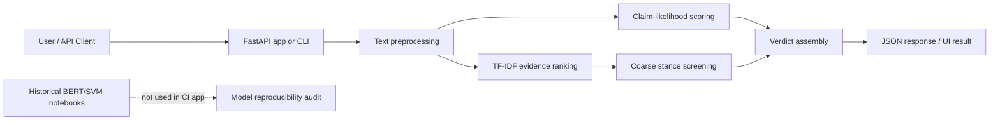

# Claim Evidence Checker

A reproducible FastAPI application for deterministic claim screening, evidence retrieval, and coarse stance analysis, built from an earlier BERT/SVM notebook experiment on conflict-news claim detection.

> This project is a portfolio-ready software version of the original notebooks. It does **not** claim to be a production fact-checker, and it does **not** present synthetic evaluation results as real-world model accuracy.

## Live Demo

Live deployment is prepared for Render with [`render.yaml`](render.yaml) and [`Dockerfile`](Dockerfile). A public URL has not been verified yet for this repository.

## Why this project matters

The project demonstrates how to turn a notebook-only ML experiment into a deployable, testable AI engineering artifact. The upgrade separates deterministic software behavior from model-quality claims, adds CI-safe evaluation, and includes overfitting checks that would be required before presenting the historical BERT/SVM model as reliable.

## What It Does

- Scores whether an input sentence looks like a factual claim.
- Ranks candidate evidence snippets using TF-IDF cosine similarity.
- Produces a conservative verdict: `supported`, `refuted`, `uncertain`, `insufficient_evidence`, or `not_a_clear_claim`.
- Serves the workflow through a FastAPI API and a lightweight web UI.
- Supports optional RSS ingestion without requiring live RSS calls in tests or CI.
- Includes reproducible evaluation, latency benchmarks, Docker, Render configuration, and GitHub Actions CI.

## Important Model and Overfitting Note

The original notebook records the following historical BERT/SVM results:

- Validation accuracy: `0.8817 (+/- 0.0058)`
- Validation F1: `0.8810 (+/- 0.0059)`
- Test accuracy: `0.9061`
- Test F1: `0.9068`

Those numbers are preserved only as historical notebook output. They are **not reproduced by the clean repository** because the original data files and trained model artifacts are not tracked. The repo now includes [`evaluation/generalization_audit.py`](evaluation/generalization_audit.py) to flag suspicious perfect scores, large train-validation gaps, small split sizes, and duplicated examples across splits when real prediction files are available.

## Architecture



## API

Start locally:

```bash
pip install -r requirements.txt
uvicorn claim_detection.api:app --reload
```

Health check:

```bash
curl http://127.0.0.1:8000/health
```

Analyze a claim:

```bash
curl -X POST http://127.0.0.1:8000/analyze \
  -H "Content-Type: application/json" \
  -d '{"claim":"The International Relief Mission delivered 20 generators to Northport hospital on Tuesday."}'
```

## CLI

```bash
python -m claim_detection.cli \
  --claim "The coastal power plant restarted full operations on Friday."
```

## Evaluation

Run:

```bash
python evaluation/run_evaluation.py
```

Latest local results:

- Cases: `8`
- Verdict accuracy on synthetic fixtures: `0.7500`
- Top-evidence match rate on synthetic fixtures: `1.0000`
- Deterministic reproducibility: `True`

The `1.0000` top-evidence match rate is intentionally labelled as a handcrafted fixture smoke-test signal, not model generalization. Full details are saved in [`evaluation/results.md`](evaluation/results.md).

## Benchmarks

Run:

```bash
python benchmarks/run_benchmarks.py --iterations 50
```

Latest local deterministic benchmark. These are latency measurements in milliseconds, not accuracy scores:

| Operation | Median latency (ms) | p95 latency (ms) |
|---|---:|---:|
| Claim scoring | `0.0419` | `0.0425` |
| Evidence ranking | `2.4488` | `2.5352` |
| Full analysis | `2.4862` | `2.5455` |

These measurements exclude BERT embedding generation, live RSS fetching, and deployed network latency. Full details are saved in [`benchmarks/results.md`](benchmarks/results.md).

## Testing

```bash
pip install -r requirements-dev.txt
ruff check .
ruff format --check .
python -m compileall claim_detection evaluation benchmarks tests
pytest
```

Latest local result: `24 passed`.

## CI/CD

GitHub Actions includes:

- linting
- formatting checks
- Python compilation
- unit/API tests
- deterministic evaluation
- benchmark smoke test
- FastAPI health-check validation

Benchmark artifacts are generated by a separate manual/path-based workflow.

## Deployment

Render is the recommended deployment target because the app is a Dockerized FastAPI service and does not require Streamlit, paid APIs, GPUs, model downloads, or secrets.

```bash
docker build -t claim-evidence-checker .
docker run -p 8000:8000 claim-evidence-checker
```

Render Blueprint deployment can use [`render.yaml`](render.yaml). See [`docs/deployment.md`](docs/deployment.md).

## Privacy

The deterministic app processes claim text and evidence text in memory. It does not call paid APIs and does not store user submissions. Standard web server access logs may include request paths and metadata, but not request bodies by default. Optional RSS ingestion fetches public RSS feeds and is not used by CI.

See [`docs/privacy.md`](docs/privacy.md).

## Limitations

- The deterministic app is an evidence-screening demo, not a professional fact-checking system.
- The historical BERT/SVM model is not reproducible from the current repository because datasets and model artifacts are missing.
- Synthetic evaluation fixtures are small and should not be used as real-world accuracy evidence.
- TF-IDF ranking can miss paraphrases and semantic entailment.
- Stance logic is lexical and intentionally conservative.

See [`docs/limitations.md`](docs/limitations.md).

## Project Structure

```text
claim_detection/
    api.py                  FastAPI app and demo UI
    claim_detector.py       deterministic claim-likelihood scoring
    evidence.py             TF-IDF evidence ranking
    stance.py               coarse lexical stance screening
    pipeline.py             end-to-end verdict assembly
    rss.py                  optional RSS ingestion
evaluation/
    datasets/               synthetic evaluation fixtures
    run_evaluation.py       reproducible deterministic evaluation
    generalization_audit.py overfitting/leakage audit helper
benchmarks/
    run_benchmarks.py       latency and memory benchmark script
tests/                      unit, API, RSS, evaluation, and benchmark tests
docs/                       audit, deployment, privacy, and architecture notes
```

## Resume Positioning

Best title: **Claim Evidence Checker: Reproducible Fact-Checking Pipeline Demo**

One-line description:

> Converted a notebook-only BERT/SVM claim-detection experiment into a deployable FastAPI evidence-screening service with deterministic evaluation, latency benchmarks, CI, Docker, and overfitting audit guardrails.

Suitable roles:

- Applied AI Engineer
- LLM/Generative AI Engineer
- Machine Learning Engineer
- Python Backend Engineer

Technologies to mention:

- Python, FastAPI, scikit-learn, TF-IDF, pytest, Docker, Render, GitHub Actions

Technologies to avoid over-emphasizing until artifacts are reproducible:

- BERT model performance
- fact-checking accuracy
- real-time RSS verification
- conflict-specific production reliability

## License

MIT License.
