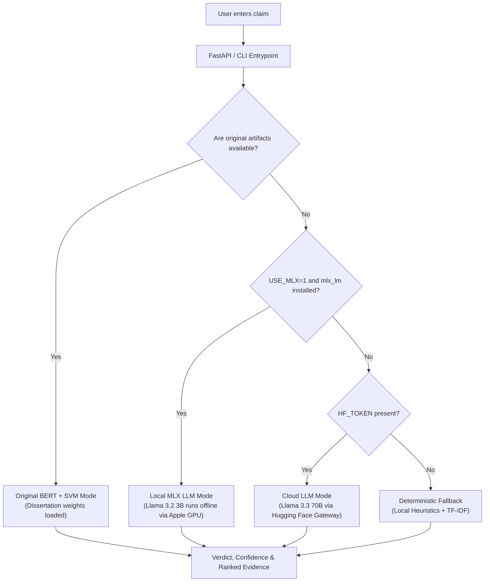

# Architecture & Flow

The system supports a hybrid architecture combining the original dissertation models, offline local LLMs, cloud serverless LLMs, and a robust rule-based fallback.

---

## How the Original Project Worked

The original project (from the experimental notebooks) was built using a custom training flow:
1. **BERT Embedding Extraction**: Text (claim + evidence) was encoded using the pre-trained `bert-base-uncased` transformer model to produce a 768-dimensional sentence embedding (using the `[CLS]` token).
2. **Support Vector Classifier (SVM)**: A linear kernel SVM classifier (`sklearn.svm.SVC`) was trained on these static BERT embeddings. It learned to predict whether a claim was `Supported` (1) or `Refuted` (0) based on training features.
3. **Fact-Checking**: The claim was verified against live news RSS articles by calculating the cosine similarity of the claim's BERT embedding against the articles' BERT embeddings.

---

## How We Made Changes to It

To package this project into a production-ready software portfolio and deploy it to Vercel:
1. **FastAPI & Web UI wrapper**: Wrapped the notebook logic into a clean web application (`api.py` and `ui.py`).
2. **Heuristic Claim Detection**: Created a deterministic claim-scoring algorithm in `claim_detector.py` to identify factual claims and reject queries, questions, or greetings before fact-checking.
3. **Vercel Size Adaptation**: Since the original PyTorch model weights (~500MB) exceed Vercel's 50MB uncompressed limit, we added a **Serverless LLM provider** fallback using `meta-llama/Llama-3.3-70B-Instruct` hosted on Hugging Face (100% free of charge).
4. **Local Hardware Acceleration (MLX)**: Added a local model option for Apple Silicon Macs to run `Llama-3.2-3B` fully offline using Apple's MLX framework.
5. **Live News Toggle**: Integrated live RSS feeds directly into the UI checkbox to enable real-time fact-checking against current world events.
