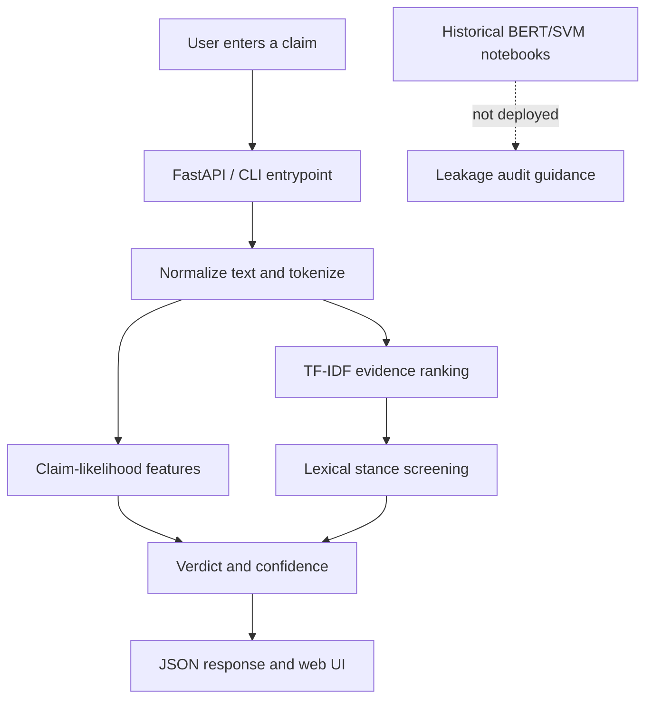

# Architecture

The productionized part of this repository is a deterministic claim-evidence screening service. The historical notebooks remain available as experiment records, but they are not imported by the deployed app or CI.

## Design Decisions

- Deterministic behavior is used for the deployed demo so CI and Render do not need GPUs, model downloads, live RSS feeds, or paid APIs.
- The LLM/transformer notebook work is treated as historical until the original datasets and artifacts are made reproducible.
- Artifact discovery is explicit: the app reports missing historical model files instead of silently pretending the BERT/SVM model is available.
- Evidence ranking and stance are separated so retrieval quality and verdict quality can be evaluated independently.
- RSS ingestion is optional and mocked in tests to avoid flaky network-dependent CI.

## Main Components

- `claim_detection/api.py`: FastAPI app, validation, and health check.
- `claim_detection/config.py`: paths and missing-artifact discovery.
- `claim_detection/embeddings.py`: lazy BERT `[CLS]` embedding helper extracted from the notebook.
- `claim_detection/model.py`: artifact-aware model service with deterministic fallback.
- `claim_detection/ui.py`: polished public demo UI.
- `claim_detection/claim_detector.py`: deterministic feature-based claim-likelihood scoring.
- `claim_detection/evidence.py`: TF-IDF similarity ranking over candidate evidence.
- `claim_detection/stance.py`: conservative marker-based stance screening.
- `evaluation/run_evaluation.py`: reproducible synthetic evaluation.
- `evaluation/leakage_audit.py`: split leakage and overfitting audit helper.
- `benchmarks/run_benchmarks.py`: local latency and memory benchmarks.
